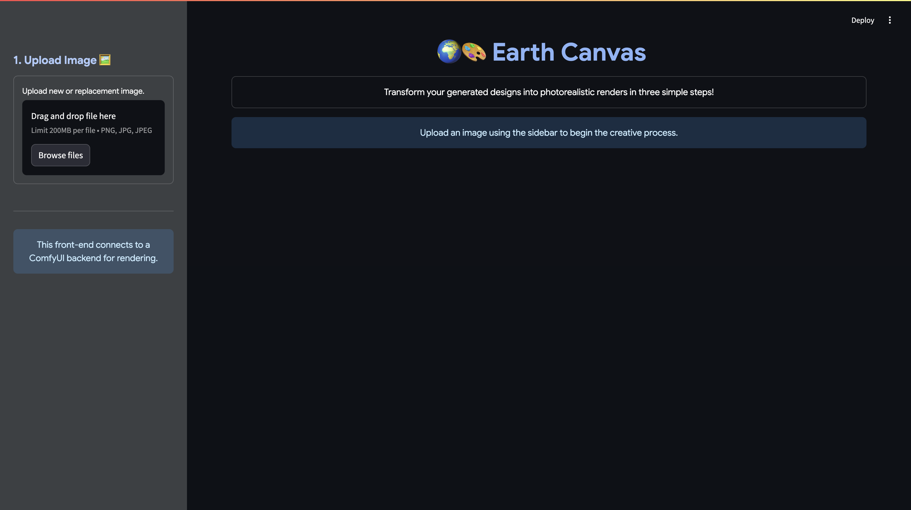

# Earth Canvas

## The Problem

We generate design options, as simple block massing, on Earth. While these are placed within their real-world context, visualizing those designs in a realiztic manner is slow and expensive. Traditional rendering can take days and needs specialized skills.

## Our Solution

Earth Canvas is a prototype of a workflow for quickly transforming simple 3D massing models into photorealistic images directly within Google Earth.

## How It Works

We use a screenshot of a basic 3D model from Google Earth, inclusive of both a generated building design and the surrounding context. A custom ComfyUI workflow, using advanced Stable Diffusion models, intelligently fills in details, textures, and lighting, transforming massing into a detailed, context-aware render.

## Why It Matters

We're solving a customer pain point of making generated designs presentation-ready. This project makes rendering accessible for contextual architectural and urban photorealism in a simple, user-manner. We bridge readily available geospatial data with advanced generative AI to create geolocated, contextually accurate renders, not just generic images.
